# Visual evidence — Labs 05 & 06

The visual evidence does not replace the code review.

## Lab 06 — Real-time collaboration

Required by the lab guide: the minimum demonstration of section 9 (nine steps)
and the acceptance criteria of section 7. Every capture below comes from a
single run of the demo against `mvn clean spring-boot:run`.

**How the captures were produced.** [`lab06/capture-lab06.js`](lab06/capture-lab06.js)
drives three isolated Chrome browser contexts — Browser A, B and C — through
the nine steps with real clicks and pointer drags. The contexts share no
cookies, `localStorage` or `sessionStorage`, which is what three separate
browsers would give. Before each capture the script waits until the change has
actually arrived in the other window, so every picture shows a state that was
reached, not a timing guess. It also records every WebSocket frame and every
`/api/boards` response of each window; the raw numbers are in
[`lab06/run-summary.json`](lab06/run-summary.json).

The caption above each window is read from that window's page at capture time:
its actor, the first 8 characters of its `boardId`, both statuses, and how many
nodes and connectors its SVG shows.

To reproduce: start the app, then `npm install puppeteer-core` in any folder
and run `node capture-lab06.js <output-dir>` from there. It uses the installed
Google Chrome and downloads no browser.

### What the run recorded

| | Browser A | Browser B | Browser C |
|---|---|---|---|
| Board | `e5fe4974…` | `e5fe4974…` (same) | `2fc3a561…` (different) |
| Actor | `client-51ff8993` | `client-8e5678e6` | `client-afdc28eb` |
| STOMP `SEND` frames published | 4 | 3 | 0 until step 8 |
| STOMP `MESSAGE` frames received | 7 | 7 | **0** until step 8 |
| Destinations it received from | `/topic/boards/e5fe4974…` only | `/topic/boards/e5fe4974…` only | `/topic/boards/2fc3a561…` only |

- A and B received the same 7 accepted events in the same order:
  `ELEMENT_CREATED`, `ELEMENT_MOVED`, `ELEMENT_CREATED`, `ELEMENT_CREATED`,
  `ELEMENT_MOVED`, `CONNECTOR_CREATED`, `ELEMENT_DELETED`. Each client also
  receives its own accepted events back — that is the server confirmation — so
  both count 7 even though A published 4 and B published 3.
- After step 6 the connector in A and in B has the same id and the same
  endpoints, drawn from (197, 137) to (405, 405).
- C was connected live from step 3 on and received nothing until it published
  on its own Board in step 8; that single event never reached A or B.
- After the reload in step 9, B made exactly one REST call,
  `GET /api/boards/{id} → 200`, and ended with the same elements and positions
  as A. Nobody pressed **Save snapshot** during the run: the events had already
  been applied to the authoritative Board on the server.
- The server log shows no rejected or discarded events for the whole run.

### Step by step

| Step (guide §9) | Capture | Acceptance criterion it backs |
|---|---|---|
| 1. A creates a Board | [`01-a-board-created.png`](lab06/01-a-board-created.png) | The initial load still goes through REST |
| 2. B loads the same `boardId` | [`02-b-board-loaded.png`](lab06/02-b-board-loaded.png) | The initial load still goes through REST |
| 3. Both connect to the live channel | [`03-live-connected.png`](lab06/03-live-connected.png) | — |
| 4. A adds a rectangle, B sees it | [`04-rectangle-created-sync.png`](lab06/04-rectangle-created-sync.png) ★ | Two browsers with the same `boardId` receive `ELEMENT_CREATED` |
| 5. B moves it, A sees it | [`05-rectangle-moved-sync.png`](lab06/05-rectangle-moved-sync.png) | Moving an element updates the other browser without reloading |
| 6. Two elements and a connector | [`06-connector-sync.png`](lab06/06-connector-sync.png) | A connector created in A appears in B with the same endpoints |
| 7. Delete an element | [`07-delete-cascade.png`](lab06/07-delete-cascade.png) ★ | Deleting an element also deletes its dependent connectors in every client |
| 8. A different Board stays isolated | [`08-session-isolation.png`](lab06/08-session-isolation.png) ★, [`08b-session-isolation-reverse.png`](lab06/08b-session-isolation-reverse.png) | A different Board receives no events from another session |
| 9. Reload and recover over REST | [`09-reload-rest-snapshot.png`](lab06/09-reload-rest-snapshot.png) | The snapshot is still recoverable through REST |

★ = the three key captures.

**1. Browser A creates a Board over REST.** `POST /api/boards` answers with the
generated `boardId`; the live channel is still `disconnected`, because opening
it is a separate, explicit step.

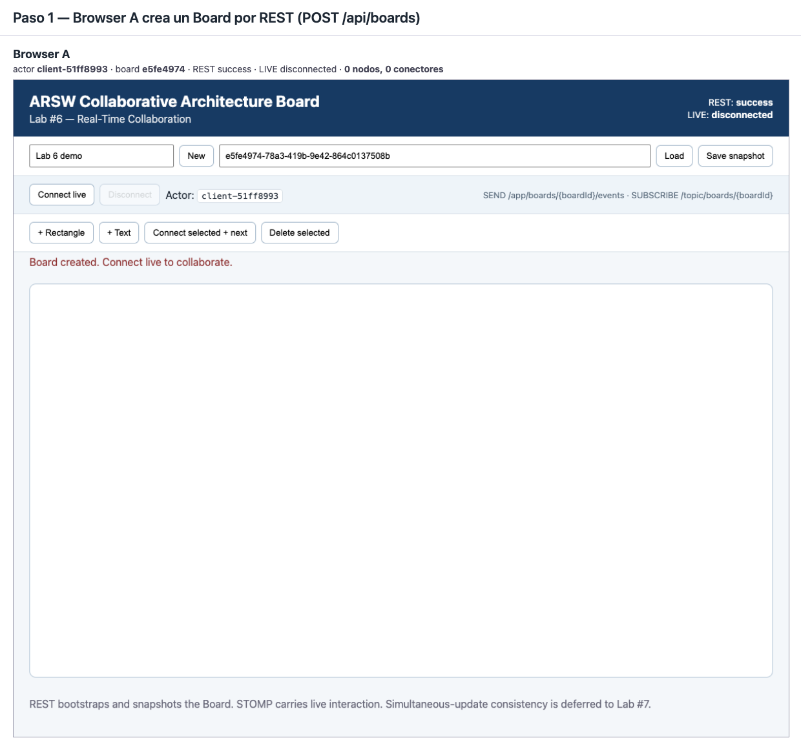

**2. Browser B loads exactly the same `boardId`** with `GET /api/boards/{id}`.

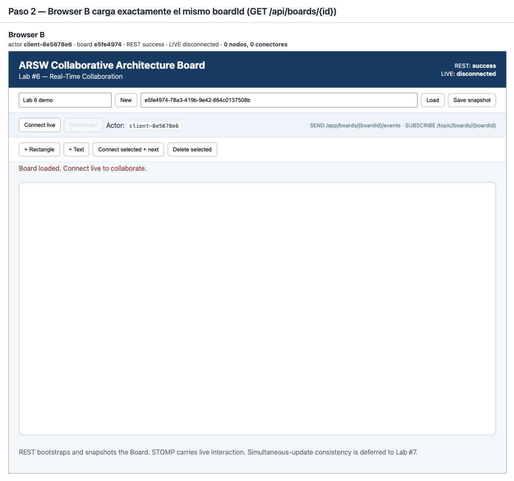

**3. Both windows connect live.** `LIVE` turns `connected` and each window
subscribes to `/topic/boards/{boardId}` of the same Board. Each one has its own
actor.

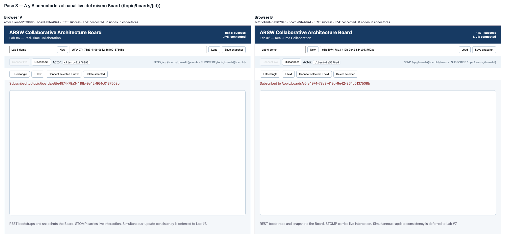

**4. ★ Two windows in sync.** A adds a rectangle. A shows
`ELEMENT_CREATED confirmed by the server` (its own event coming back after the
server accepted it), and B shows `ELEMENT_CREATED applied from <A's actor>`,
without reloading.

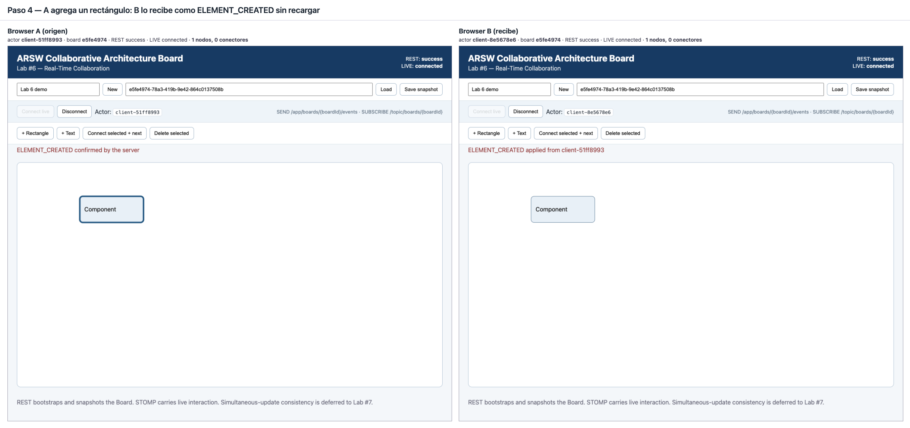

**5. B drags the rectangle; A follows.** The move is published once, when the
drag ends, as a single `ELEMENT_MOVED` with the absolute position.

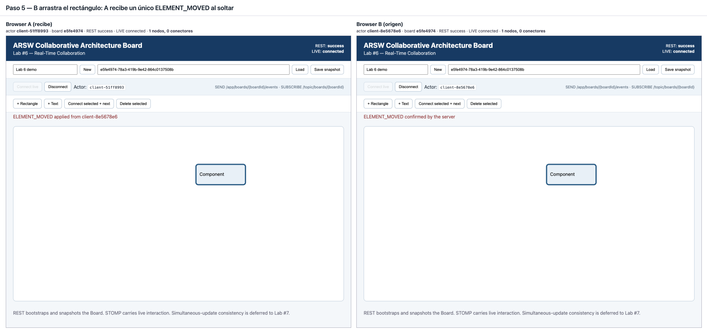

**6. Two new elements and a connector.** A adds a second rectangle, B adds a
text, A drags that text (so this move goes A → B, the opposite direction of
step 5), and A connects the second rectangle to the text. B receives
`CONNECTOR_CREATED` and draws the connector between the same two elements.
Both windows: 3 nodes and 1 connector.

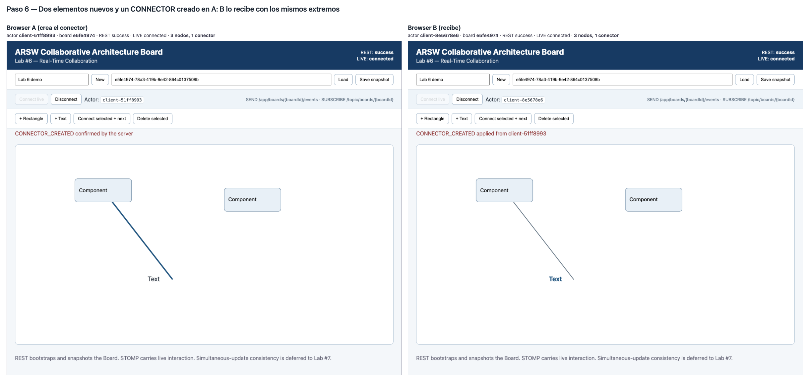

**7. ★ Cascade delete.** B selects the connected rectangle and deletes it. The
connector that referenced it disappears with it, in both windows: from 3 nodes
and 1 connector to 2 nodes and 0 connectors. The server applies the cascade to
the authoritative Board before broadcasting, and each client's `BoardState`
applies the same cascade when the `ELEMENT_DELETED` arrives, so no client is
left holding a dangling connector.

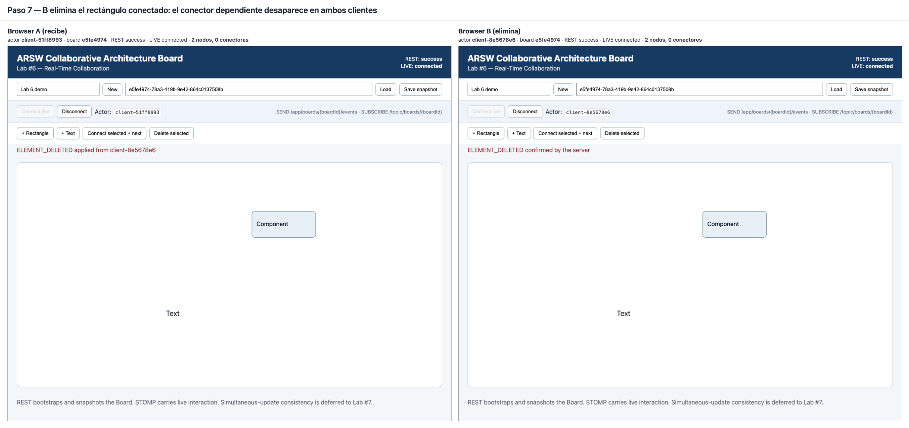

**8. ★ Session isolation.** Browser C has been connected live since step 3, but
to a different Board. After everything A and B did, it still shows 0 nodes and
its last message is still the subscription to its own topic: it received 0
`MESSAGE` frames.

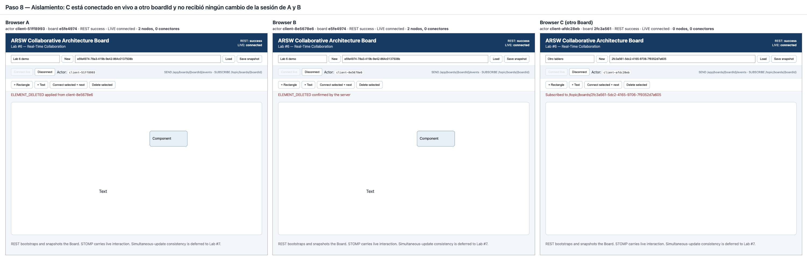

And the other direction: C adds a rectangle to its own Board, and A and B do
not receive it.

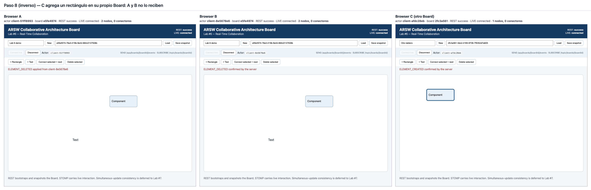

**9. Reload and recover over REST.** B reloads the page (`LIVE` goes back to
`disconnected`, the actor survives because it lives in `sessionStorage`) and
presses **Load**. `GET /api/boards/{id}` returns the Board accumulated by the
events — the same elements and positions A has.

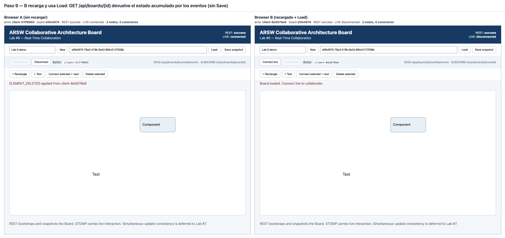

## Lab 05 — Interactive Board

Required by the lab guide (section 10): a screenshot or short GIF showing a loaded Board with two connected elements and a change that was saved and reloaded.

**1. `board-saved.png`** — a RECTANGLE and a TEXT joined by a CONNECTOR, right after pressing **Save** (status `success`, message `Board saved`):

**2. `board-reloaded.png`** — the same board after reloading the page and pressing **Load** with that `boardId` (message `Board loaded`). The two connected elements and their positions came back from the server:

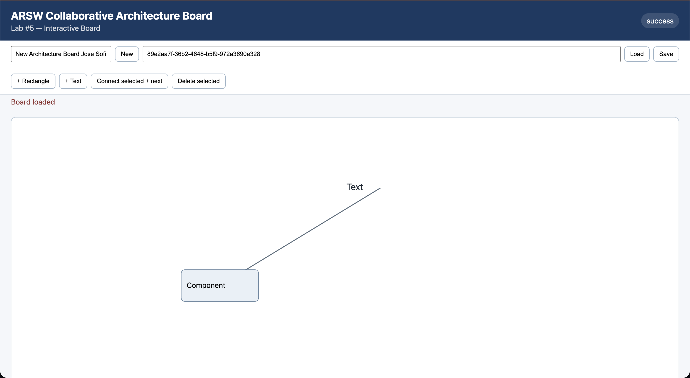

How to reproduce the flow:

1. `mvn clean spring-boot:run` (the `clean` matters: a stale `target/` can serve the old Lab 04 landing page).
2. Open <http://localhost:8080/>, type a board name and press **New** — the generated `boardId` appears in the id field.
3. Press **+ Rectangle** and **+ Text**, then drag them apart on the canvas.
4. Click one element, press **Connect selected + next**, then click the other one — a connector line appears between their centers.
5. Press **Save** (status turns `success`, message `Board saved`).
6. Reload the page, paste the `boardId` and press **Load** — the same three elements come back.
